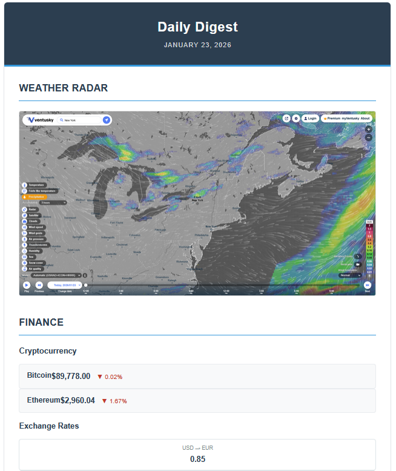

# Daily Digest Automation

 

>An automated tool that scrapes news, weather, and finance data, compiling them into a  daily email report.

## Preview



## Features

- **World & Tech News**: Aggregates top headlines from major global sources.
- **Automated Weather Radar**: Captures a real-time screenshot of the rain radar for your specific city.
- **Financial Overview**: Tracks Crypto (Bitcoin/Ethereum) and major Exchange Rates (USD/EUR/GBP/JPY).
- **Professional UI**: Generates a clean, modern HTML email template.
- **Fully Automated**: Includes scripts for Windows Task Scheduler integration.

## Built With

*   **Language**: [Python 3.13](https://www.python.org/)
*   **Web Scraping**: `BeautifulSoup4`, `Requests`, `Feedparser`
*   **Browser Automation**: `Selenium` (for Weather Radar screenshots)
*   **Email**: `smtplib` (SMTP/TLS)

## Setup

### 1. Clone the repository
```bash
git clone https://github.com/Alexlojr/DailyDigest
cd DailyDigest
```

### 2. Create Virtual Environment
It is recommended to use a virtual environment to manage dependencies.
```bash
python -m venv .venv
# Activate on Windows:
.venv\Scripts\activate
# Activate on Mac/Linux:
source .venv/bin/activate
```

### 3. Install Dependencies
```bash
pip install -r requirements.txt
```

### 4. Configuration
1.  **Environment Variables**:
    *   Duplicate `.env.example` to a new file named `.env`.
    *   Fill in your credentials (Enable **App Passwords** in your Google Account for Gmail).
    ```env
    SENDER_EMAIL=your_email@gmail.com
    SENDER_PASSWORD=your_app_password_here
    RECIPIENT_EMAIL=recipient_email@exemplo.com
    ```

2.  **User Config**:
    *   Edit `src/configs/config.json` to set your target city for weather, and your news sources and niches of interest.

## Usage

### Manual Run
To run the script once immediately:
```bash
python src/main/main.py
```

### Automated Run (Windows)
To schedule this to run automatically every morning:
1.  Locate `run_daily_digest.bat` in the project root.
2.  Test it by double-clicking.
3.  Open **Windows Task Scheduler** -> **Create Basic Task**.
4.  Set trigger to **Daily** (e.g., 07:00 AM).
5.  Action: **Start a Program** -> Select `run_daily_digest.bat`.
6.  **Important**: In "Start in (Optional)", paste the full path to your project folder.

## Contributing
Feel free to submit issues and enhancement requests.

## License
This project is licensed under the MIT License - see the LICENSE file for details.